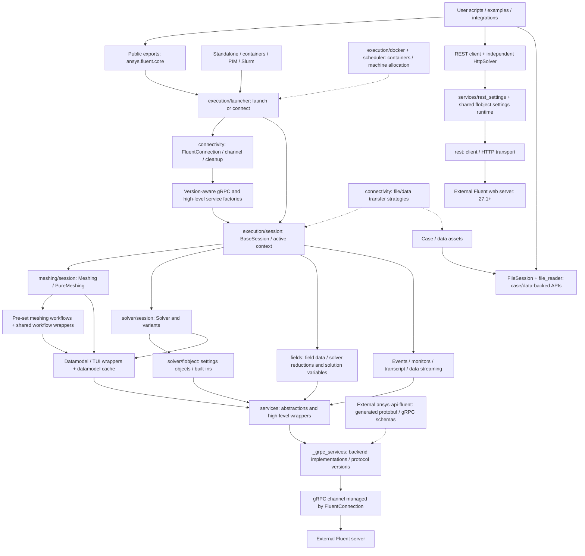
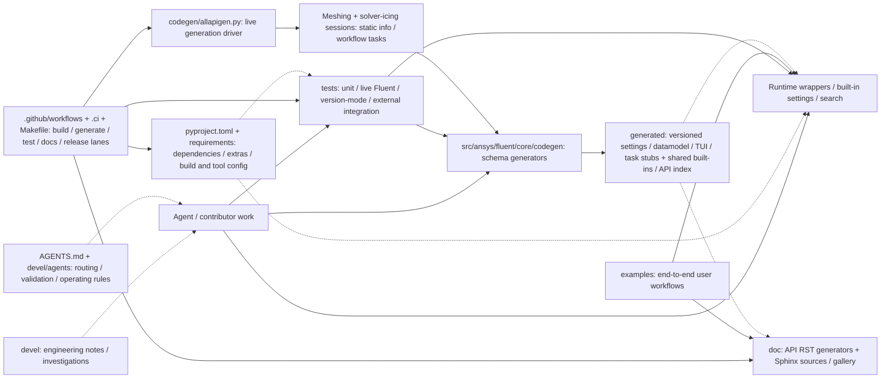

# Architecture map

Follow `AGENTS.md`. Source paths below are relative to `src/ansys/fluent/core`; test targets and execution requirements live in `devel/agents/testing.md`.

## Project orchestration

Read the diagrams for relationships, then use the owner table for exact edit locations. Arrows show conceptual control/data flow, not class inheritance or every import; dashed arrows show supporting inputs. Fluent itself is an external process, not Python code in this repository.

### Runtime paths

- Settings, datamodel and TUI are distinct surfaces; they share session/service infrastructure but have different wrappers and schemas. Fields use runtime APIs, not generated settings wrappers.
- Expression/naming helpers support variable access; RP/Scheme helpers use services. Parametric studies orchestrate sessions; system coupling integrates solver operations with external coupled workflows.
- UI integrates session web/Jupyter presentation. Configuration, diagnostics, utilities, shared types and example downloads support the runtime across layers; search reads the generated API index rather than being a transport.

### Generation and repository tooling

Paths in this diagram are repository-relative. Detailed commands and prerequisites remain in `devel/agents/workflows.md` rather than being duplicated here.

## Source owners and entry points

| Feature / public surface | Source owner |
| --- | --- |
| Public exports, legacy aliases; configuration/environment defaults | `__init__.py`; `module_config.py` |
| `launch_fluent()`, `connect_to_fluent()`; standalone/container/PIM/Slurm | `execution/launcher/launcher.py`; `execution/launcher/standalone_launcher.py`, `execution/launcher/container_launcher.py`, `execution/launcher/pim_launcher.py`, `execution/launcher/slurm_launcher.py` |
| Base session, `using()`, file-backed `FileSession` | `execution/session/session.py`; `execution/session/file.py` |
| gRPC connection lifetime, health checks, cleanup; file/data transfer | `connectivity/fluent_connection.py`; `connectivity/file_transfer_service.py`, `connectivity/data_transfer.py` |
| `Meshing`, `PureMeshing`; pre-set workflows and solver transitions | `meshing/session`; `meshing/meshing_workflow.py`, `meshing/meshing_workflow_old.py`; shared `workflow.py`, `workflow_old.py` |
| `Solver`, `SolverAero`, `SolverIcing`, `SolverLite`, `PrePost`; solve-mode APIs | `solver/session`; settings runtime in `solver/flobject.py` |
| `solver.settings`; built-in settings exports from `ansys.fluent.core.solver` | `solver/flobject.py`, `solver/settings_builtin_bases.py`, `solver/settings_builtin_data.py`; `services/settings.py` |
| Meshing datamodel roots; `session.tui` | `services/object_model.py`, `_data_model_cache.py`; `services/text_interface.py` |
| `session.fields.field_data`, `.new_batch()`; solver fields: `.reduction`, `.solution_variable_data`, `.solution_variable_info` | `fields/field_data/live_field_data.py`; `fields/reduction/reduction.py`; `fields/solution_variables/solution_variables.py` |
| Service abstractions/wrappers; events, monitors, transcripts and datamodel/field streaming | `services`; `services/streaming_services`; gRPC implementations in `_grpc_services` |
| Case/data readers and file-backed fields | `file_reader`; `execution/session/file.py` |
| `search(...)`, logging, journaling, exceptions | `diagnostics`; search implementation `diagnostics/search.py`, API index generator `codegen/api_tree.py` |
| Parametric studies; coupled simulation | `local_parametric_study.py`; `system_coupling.py` |
| Batch service calls; separately, queued/remote execution | `services/batch_ops.py`; `execution/scheduler`, `execution/docker`, launchers above |
| Expression construction/evaluation, RP variables, Scheme, file S-expressions | `expressions`; `rpvars.py`; `services/scheme_interpreter.py`; `file_reader/lispy.py` |
| `rest.connect_to_webserver()`, `FluentRestClient`, `HttpSolver` | `rest/client.py`, `rest/transport.py`, `services/rest_settings.py`, `solver/session/http_solver.py` |
| Web/Jupyter UI; utilities/setup; example downloads/assets | `ui`; `utils`; `examples` |
| Generated settings/datamodel/TUI/built-ins/search index; generation implementation | `generated`; `codegen/settingsgen.py`, `codegen/datamodelgen.py`, `codegen/tuigen.py`, `codegen/builtin_settingsgen.py`, `codegen/api_tree.py` (repository-root `codegen/allapigen.py` is the live-Fluent driver) |
| Shared types/launcher arguments; descriptor naming for expressions/fields/solution variables | `_types.py`; `_variable_strategies` |
| Legacy standalone datamodel-server helper, not a normal session entry point | `_stand_alone_datamodel_client/_datamodel_client.py`; verify its old imports/dependencies before use |

### Runtime contracts

- `FluentMode` in `execution/launcher/launch_options.py` accepts `meshing`, `pure_meshing`, `solver` (default), `solver_icing`, `solver_aero`, `pre_post`. The first five route to their corresponding sessions; `pre_post` currently maps to `Solver`. Do not infer launch support from the existence of a session class.
- `BaseSession` and `using()` live in execution; mode-specific sessions live in meshing/solver. `FileSession` is file-backed, not a live solver subclass; `HttpSolver` is independent of `BaseSession` and gRPC infrastructure.
- Solver settings objects use `solver/flobject.py` over a settings service. `get_root()` builds classes from static info when `config.use_runtime_python_classes` is enabled or the generated settings file is missing; otherwise it loads version-specific generated classes.
- Generated output uses version directories under `generated`, plus shared `generated/solver` and `generated/api_tree` data. Versions present in a local checkout depend on generation/install state; do not assume every supported version is generated locally.
- Legacy names registered in `__init__.py` are compatibility aliases, not current source locations. Start from the implementation path and check exports separately.

## Architectural rules

- The runtime package and session layer are the primary user-facing entry points.
- Generated code is authoritative for many schema-driven APIs; do not hand-edit it lightly.
- Field-data, reduction, settings, and datamodel access are higher-value feature areas than TUI-only command wrappers.
- For any version-specific path, prefer the generated or compatibility-aware implementation and confirm with the closest tests.
- If a feature is unclear, ask the user before assuming the route or test target.
- Fix runtime navigation/behavior in its owning wrapper or service; change generation logic for schema-output defects rather than hand-editing generated output.

Session, workflow, service and schema behavior varies by Fluent version, mode, packaging and environment. Check the closest compatibility-aware implementation and test rather than assuming one path.

File-backed APIs need no live server themselves; reader tests may need assets/downloads or Fluent. Search consumes generated API-index data and semantic search needs NLTK data. `HttpSolver` targets Fluent 27.1+; REST settings can use runtime classes without generated files. UI needs `ui` / `ui-jupyter` extras; Python-console tests are not UI-rendering coverage.
