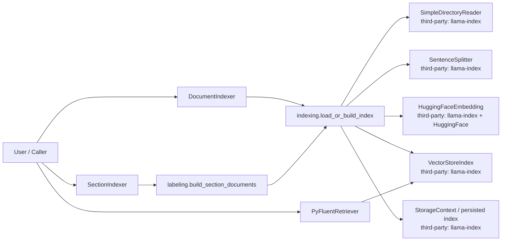
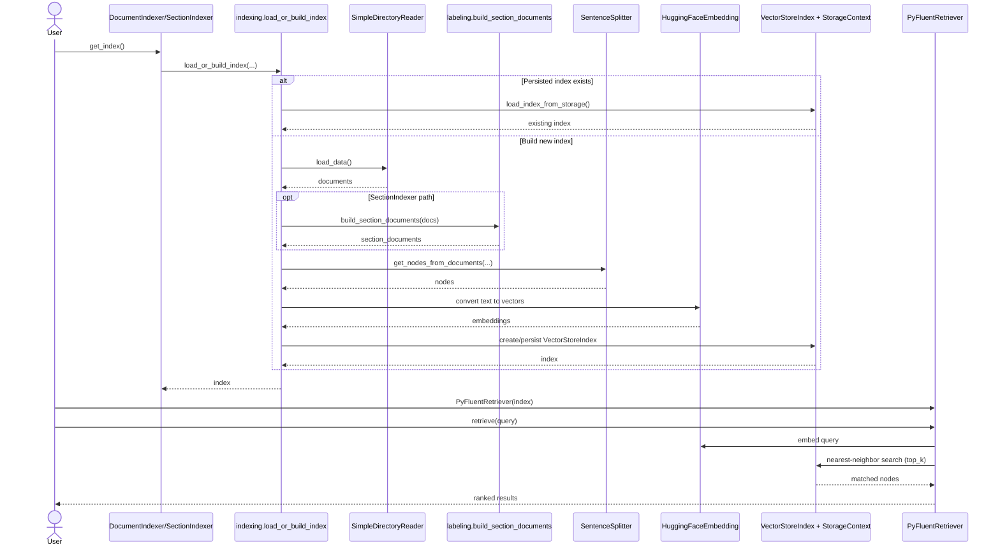
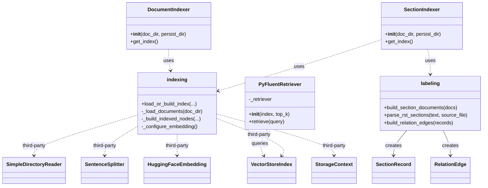

# PyFluentAI Design Document

## 1. Purpose and Audience

This document explains how the project is designed today, for software developers who may not have an AI background.

The project goal is simple:

- Load PyFluent documentation
- Build a searchable index from it
- Retrieve the most relevant documentation snippets for a user question

Think of this as a specialized search engine for technical docs, where search is based on meaning rather than exact keywords.

## 2. What Problem This Solves

PyFluent documentation is spread across a number of files. A user asks a question in natural language, and we want to quickly find the small set of docs that most likely answer it.

An additional objective is data privacy: users should be able to run queries on their local machine without sending documentation content or query text to external internet services.

Without this system:

- Users manually search many files
- Keyword search misses semantically related content
- Teams may avoid AI-assisted search if it requires sending internal text to third-party hosted APIs

With this system:

- Questions are converted to vectors (numeric meaning representations)
- Documentation chunks are also vectors
- Nearest vector matches are returned as likely answers
- Query processing and retrieval run locally in-process, so documentation text and user queries stay on the local system during normal operation

Privacy posture of the current design:

- Served: the core indexing and retrieval pipeline is local-first and does not depend on a hosted embedding or hosted retrieval API.
- Caveat: first-time environment setup may download model/package artifacts (for example, embedding model weights) from external registries.
- Operational guidance: after dependencies and model files are installed/cached, routine query-time operation can be performed offline/local-only.

## 3. High-Level Architecture

The architecture has three major stages.

1. Ingestion and indexing
- Read source files from the documentation tree
- Split files into manageable chunks
- Convert chunks into vectors
- Store vectors in a local index
2. Retrieval
- Convert user question into a vector
- Find top K nearest chunk vectors
- Return those chunks and metadata
3. Optional generation
- Current repository focuses on ingestion and retrieval
- A downstream LLM can use retrieved chunks to generate final answers

### 3.1 UML: High-Level Object Interaction

### 3.2 UML: Pipeline Sequence (Build + Query)

### 3.3 UML: Static Class and Dependency Diagram

## 4. Core Components and Responsibilities

### 4.1 Shared Indexing Pipeline

File: indexing.py

Responsibilities:

- Choose how text meaning is represented for similarity search
- Load documentation files
- Split text into chunks using a deterministic text splitter
- Remove chunks that are unlikely to be useful for retrieval
- Reuse an existing persisted index when available, otherwise build a new one

Conceptual explanation:

- The embedding model acts as the project's "meaning mapper": it converts text into vectors so that semantically related text ends up close together.
- This model is not used to split text directly. Splitting is done first by a rule-based sentence chunker.
- The model strongly influences retrieval quality after indexing, because it determines what "similar" means at query time.
- Chunking and filtering are therefore tuned to support the model: chunk sizes and overlap aim to preserve enough context for good embeddings, while filtering reduces obvious noise before vectors are created.

How chunking works:

- The project uses llama-index's SentenceSplitter with configured chunk size and overlap.
- In practice, this is a text-structure-based step (sentence/paragraph aware), not a model-driven segmentation step.
- The overlap keeps neighboring context, reducing boundary-loss when a key explanation spans adjacent chunks.

How filtering works:

- Filtering is primarily heuristic and metadata-based, not model inference.
- Very short chunks are usually less informative, so minimum-length filtering reduces low-value fragments.
- A stub-file exception preserves small files that may still be important references.
- The embedding model affects filtering indirectly: because vectors are built from surviving chunks, filtering decisions shape what semantic space is searchable.

Control flow note:

- If a persisted index already exists, the code loads it directly.
- In that load-from-disk path, read/split/filter/re-embed steps are skipped.
- If no persisted index exists, the full pipeline (load -> split -> filter -> embed -> index) runs.

Key behaviors:

- Embedding model is BAAI/bge-small-en-v1.5
- Supported file types include rst, py, pyi
- Certain files are excluded (for example index and contents wrappers)
- Small files are preserved via a stub file threshold so short but important references are not lost

Model selection rationale:

- Why this model was chosen:
- It is lightweight enough for local development while still providing solid semantic retrieval quality for technical text.
- It is open and easy to run in a local Python workflow without external API dependencies.

- Strengths:
- Good quality-to-speed tradeoff for CPU/GPU local indexing.
- Reliable baseline for English technical documentation retrieval.

- Weaknesses and considerations:
- Larger models may improve difficult retrieval cases but increase latency and resource cost.
- Domain-specific terms may still need reranking or metadata-aware retrieval for best precision.
- Model choice should be treated as a tunable system parameter, validated with retrieval benchmarks.

Why this matters:

- This module centralizes indexing logic so all indexer variants behave consistently.

### 4.2 DocumentIndexer

File: document_indexer.py

Responsibilities:

- Use shared pipeline with minimal transformation
- Keep document granularity close to source file structure

When to use:

- You want straightforward file-oriented retrieval behavior
- You want fewer preprocessing assumptions

### 4.3 SectionIndexer

File: section_indexer.py

Responsibilities:

- Apply section-aware transformation before indexing
- Preserve richer section metadata (headings, section lineage, content type hints)

When to use:

- You want better grounding at section level
- You want retrieval to reflect documentation structure, not only raw file text

Important note:

- This path depends on section labeling output shape, so contracts between indexing and labeling should remain stable.

### 4.4 Labeling and Structural Parsing

File: labeling.py

Responsibilities:

- Parse rst into sections
- Build structured section records
- Extract references, directives, and toctree entries
- Build relation edges between sections and referenced entities
- Export records and edges as JSONL artifacts

Main data structures:

- SectionRecord: one parsed section and its metadata
- RelationEdge: typed connection from one section to another target

Why this matters:

- Enables richer retrieval strategies beyond plain vector similarity
- Provides graph-like metadata for future ranking and explainability features

### 4.5 Retriever Facade

File: retriever.py

Responsibilities:

- Wrap llama-index retriever creation
- Provide a simple retrieve(query) call

Why this matters:

- Keeps retrieval API small and stable for tests and app integration

### 4.6 Public Package Surface

File: __init__.py

Responsibilities:

- Re-export high-level classes and selected advanced labeling utilities
- Provide ergonomic imports for callers

Why this matters:

- Callers should import core workflow types from one place.

### 4.7 Test Suite

File: test_retrieve_files_for_query.py and related tests

Responsibilities:

- Validate retrieval returns results
- Validate expected file presence for known queries
- Compare behavior across DocumentIndexer and SectionIndexer
- Encode known gaps explicitly via expected-failure behavior where appropriate

Why this matters:

- Retrieval quality is behavioral, so tests represent product expectations, not just code coverage.

## 5. End-to-End Data Flow

1. Input documents
- Documentation is read from docsource
2. Optional structural transformation
- DocumentIndexer: identity path
- SectionIndexer: transform into section-aware documents
3. Chunking
- Sentence splitter creates chunks with overlap
4. Filtering
- Keep chunks above minimum size
- Keep short-file chunks via stub rule
5. Indexing
- Build vector index in memory or load from persisted storage
6. Query-time retrieval
- User query is embedded
- Top K nearest chunks returned
7. Consumer usage
- Tests assert expected filenames
- Future app layer can pass retrieved text into an LLM answer generator

## 6. Key Design Decisions and Tradeoffs

### Decision: Shared indexing core

Benefit:

- Less duplication, consistent behavior

Tradeoff:

- Function contracts are critical; changes can break multiple indexers

### Decision: Two indexer strategies

Benefit:

- Supports side-by-side comparison of retrieval approaches

Tradeoff:

- More test matrix and metadata-key handling complexity

### Decision: Keep short files via stub threshold

Benefit:

- Prevents losing concise but high-value reference docs

Tradeoff:

- Can introduce noisier small chunks into retrieval set

### Decision: Persisted index support

Benefit:

- Faster subsequent runs

Tradeoff:

- Cache can hide indexing regressions unless tests clear persisted artifacts

## 7. Current Constraints and Risks

1. Metadata key consistency
- Some paths use file_name, others source_file
- Retrieval and tests must handle both safely
2. API contract drift risk
- Labeling helper return types must stay aligned with indexer expectations
3. Ranking-only retrieval limitations
- Pure top K similarity may miss transitive or context-dependent docs
4. README drift
- Architecture description can lag behind current module names and structure

## 8. How to Extend the Project Safely

### Add a new indexer variant

- Reuse shared indexing pipeline
- Define clear transform contract returning documents for chunking
- Add parametric tests alongside existing indexers

### Add richer retrieval ranking

- Keep base retriever unchanged
- Add a post-retrieval reranker module using metadata and relation edges
- Compare with baseline via existing query tests

### Add generation layer

- Keep retrieval independent and testable
- Add answer synthesis as a separate stage consuming retrieved chunks

## 9. Natural Next Steps (Recommended Roadmap)

1. Stabilize interfaces
- Standardize labeling function names and return contracts
- Ensure public exports exactly match available symbols
2. Improve retrieval evaluation
- Add query set with expected relevance tiers (must-have, good-to-have)
- Track recall at K and precision at K over time
3. Add reranking using structure
- Use section metadata and relation edges to boost connected sections
- Compare against baseline vector-only retrieval
4. Harden persistence workflow
- Add utility to clear or version persisted indexes
- Ensure tests cannot accidentally pass because of stale artifacts
5. Improve developer ergonomics
- Add one simple pipeline example script: build index then run sample query
- Keep imports and top-level API focused and predictable
6. Refresh README
- Align project structure with current modules (document_indexer, section_indexer, labeling, indexing)
- Link this design document from README.md

## 10. Glossary (Plain Language)

- Embedding: A numeric representation of text meaning.
- Vector index: A data structure for fast nearest-neighbor lookup over embeddings.
- Chunk: A small piece of a larger document used for indexing and retrieval.
- Top K: The number of highest-ranked retrieval results returned.
- Reranking: Reordering retrieved candidates using extra logic beyond initial similarity.
- RAG: Retrieval-Augmented Generation, where retrieved text is supplied to a language model for final answer generation.