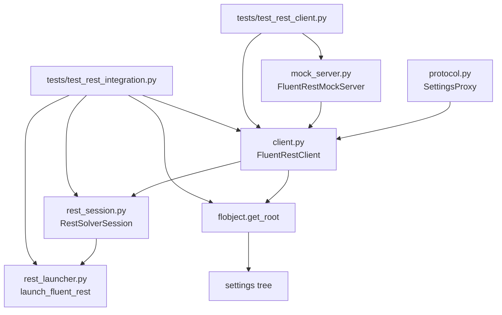
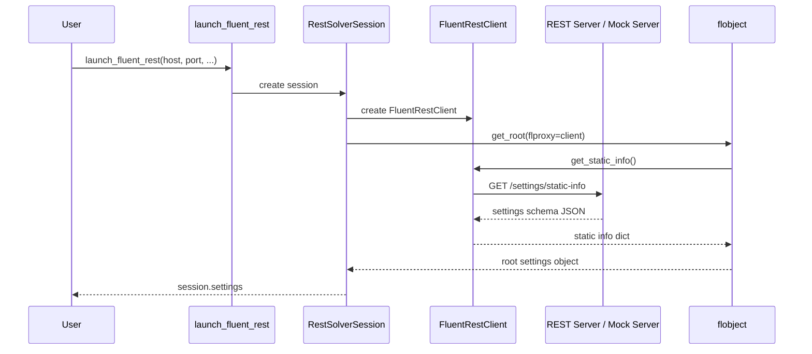

# PyFluent REST Transport

This folder contains the REST-based settings transport for PyFluent.

The main idea is simple:

- `flobject` already knows how to build the settings tree.
- `flobject` only needs a proxy object with the right methods.
- `FluentRestClient` implements those methods over HTTP.
- Because of that, the same settings tree can work over REST instead of gRPC.

This README explains:

1. what each file does,
2. how the files connect,
3. what each main function does,
4. how the request flow works,
5. how the tests prove it works.

The goal is to make the folder easy to understand for a junior developer.

---

## 1. Simple mental model

Think about the REST layer as 4 pieces:

1. **Protocol**
   Defines the method names that a settings proxy must provide.

2. **Client**
   Sends HTTP requests to a REST server.

3. **Session / Launcher**
   Builds a client and plugs it into PyFluent's settings tree.

4. **Mock server + tests**
   Simulate a Fluent REST server so everything can be tested locally.

---

## 2. Folder structure

```text
src/ansys/fluent/core/rest/
│
├── __init__.py
├── client.py
├── mock_server.py
├── protocol.py
├── rest_session.py
├── rest_launcher.py
├── README.md
└── tests/
    ├── __init__.py
    ├── conftest.py
    ├── test_rest_client.py
    └── test_rest_integration.py
```

---

## 3. What each file does

### `__init__.py`

This is the package entry point.

It re-exports the main public objects:

- `FluentRestClient`
- `FluentRestMockServer`
- `SettingsProxy`
- `RestSolverSession`
- `launch_fluent_rest`

Why this file matters:

- It gives one clean import location.
- Users do not need to know the internal file layout.

Example:

```python
from ansys.fluent.core.rest import FluentRestClient, RestSolverSession
```

---

### `protocol.py`

This file contains `SettingsProxy`, which is a `typing.Protocol`.

In simple terms, it says:

> “Any object with these methods can act like a settings backend for `flobject`.”

This file does **not** send requests and does **not** create sessions.
It is only a formal contract.

The 14 required methods are:

- `get_static_info()`
- `get_var(path)`
- `set_var(path, value)`
- `get_attrs(path, attrs, recursive=False)`
- `get_object_names(path)`
- `get_list_size(path)`
- `create(path, name)`
- `delete(path, name)`
- `rename(path, new, old)`
- `resize_list_object(path, size)`
- `execute_cmd(path, command, **kwds)`
- `execute_query(path, query, **kwds)`
- `has_wildcard(name)`
- `is_interactive_mode()`

Why this file matters:

- It documents the exact API that `flobject` expects.
- It makes type-checking easier.
- It makes it obvious that REST and gRPC are following the same contract.

---

### `client.py`

This is the most important runtime file.

It contains:

- `FluentRestError`
- `_Endpoints`
- `FluentRestClient`

#### `FluentRestError`

This is a small custom exception.

It is raised when the REST server returns an HTTP error, for example:

- `404 Not Found`
- `400 Bad Request`
- `500 Internal Server Error`

Why this is useful:

- It turns raw HTTP failures into Python exceptions.
- The caller gets a cleaner error message like `HTTP 404: Path not found`.

#### `_Endpoints`

This class stores endpoint names in one place.

Examples:

- `settings/static-info`
- `settings/var`
- `settings/attrs`
- `settings/object-names`
- `settings/resize-list`

Why this is useful:

- If the real REST API changes later, this is the first place to update.
- The rest of the client code stays simple.

#### `FluentRestClient`

This class is the real REST proxy.

It implements the `SettingsProxy` contract using `urllib` from the standard
library.

##### Internal helper functions

- `_url(endpoint, **query_params)`
  - Builds the final URL.
  - Example: base URL + endpoint + query string.

- `_request(method, endpoint, query_params=None, body=None)`
  - Sends the HTTP request.
  - Adds headers.
  - Serializes JSON request bodies.
  - Parses JSON responses.
  - Converts HTTP errors into `FluentRestError`.

##### Main public functions

- `get_static_info()`
  - Gets the full settings structure.
  - This is the most important call for `flobject`.
  - `flobject.get_root()` uses this to build the settings tree.

- `get_var(path)`
  - Reads a value from a settings path.

- `set_var(path, value)`
  - Writes a value to a settings path.

- `get_attrs(path, attrs, recursive=False)`
  - Gets metadata such as allowed values or active state.

- `get_object_names(path)`
  - Lists names under a named-object container.
  - Example: names of inlet or outlet boundaries.

- `create(path, name)`
  - Creates a named object.

- `delete(path, name)`
  - Deletes a named object.

- `rename(path, new, old)`
  - Renames a named object.

- `get_list_size(path)`
  - Gets the size of a list object.

- `resize_list_object(path, size)`
  - Changes the size of a list object.

- `execute_cmd(path, command, **kwds)`
  - Executes a settings command.

- `execute_query(path, query, **kwds)`
  - Executes a settings query.

- `has_wildcard(name)`
  - Local helper.
  - Checks if a name contains wildcard characters like `*` or `?`.

- `is_interactive_mode()`
  - Always returns `False`.
  - REST is treated as non-interactive.

Why this file matters:

- This is the REST replacement for the gRPC settings service.
- This is the object that `flobject` talks to.

---

### `mock_server.py`

This file provides a fake REST server for development and tests.

It contains:

- default in-memory data,
- request handlers,
- `FluentRestMockServer`.

#### Default data

The file defines several preloaded dictionaries:

- `_DEFAULT_VARS`
  - actual values for settings paths.

- `_DEFAULT_NAMED_OBJECTS`
  - named objects such as boundary names.

- `_DEFAULT_LIST_SIZES`
  - sizes for list objects.

- `_DEFAULT_ATTRS`
  - metadata like allowed values.

- `_STATIC_INFO`
  - schema of the settings tree.
  - This is the most important piece for building the tree.

- `_COMMAND_HANDLERS`
  - mock implementations of commands.

- `_QUERY_HANDLERS`
  - mock implementations of queries.

#### `_Handler`

This class handles incoming HTTP requests.

Main helper methods:

- `_parse_url()`
  - splits URL path and query parameters.

- `_read_body()`
  - reads JSON from the request body.

- `_send_json(data, status=200)`
  - sends JSON back to the client.

- `_send_error(status, message)`
  - sends error responses.

- `_store`
  - gives access to the server's in-memory data store.

Main HTTP methods:

- `do_GET()`
  - handles reads such as `static-info`, `var`, `attrs`, `object-names`,
    and `list-size`.

- `do_PUT()`
  - handles writing values and resizing lists.

- `do_POST()`
  - handles creation, commands, and queries.

- `do_DELETE()`
  - handles deletion of named objects.

- `do_PATCH()`
  - handles renaming of named objects.

#### `FluentRestMockServer`

This is the server wrapper class used by tests and examples.

Main functions:

- `__init__(port=0, host="127.0.0.1")`
  - builds a new isolated in-memory store.

- `port`
  - returns the active server port.

- `base_url`
  - returns a complete base URL.

- `start()`
  - starts the HTTP server in a background thread.

- `stop()`
  - shuts down the server cleanly.

- `__enter__()` and `__exit__()`
  - allow use as a context manager.

Why this file matters:

- It lets the REST client be tested without a real Fluent server.
- It proves the transport layer works on its own.

---

### `rest_session.py`

This file introduces `RestSolverSession`.

Its job is small but important:

1. create `FluentRestClient`,
2. pass that client into `flobject.get_root(...)`,
3. expose the result as `session.settings`.

#### `RestSolverSession.__init__(...)`

This constructor:

- accepts `base_url`, `auth_token`, `version`, and `timeout`,
- creates a `FluentRestClient`,
- calls `get_root(self._client, version=version)`,
- stores the returned root settings object.

#### `client`

Returns the underlying `FluentRestClient`.

#### `settings`

Returns the root settings tree.

Why this file matters:

- This is the bridge between the low-level HTTP client and the high-level
  PyFluent settings API.
- It gives a small session object without any gRPC-only constructor complexity.

---

### `rest_launcher.py`

This file contains one convenience function:

- `launch_fluent_rest(...)`

What it does:

1. builds a URL from `host`, `port`, and `scheme`,
2. creates `RestSolverSession`,
3. returns that session.

This file is intentionally small.

Why this file matters:

- It gives a clean entry point similar in spirit to other launcher helpers.
- It keeps session creation simple for users.

---

### `tests/conftest.py`

This file contains shared pytest fixtures.

It creates:

- a mock server fixture,
- a client fixture connected to that server.

Why this matters:

- Tests can reuse the same setup code.
- Test files stay smaller and easier to read.

---

### `tests/test_rest_client.py`

This file tests the REST client and mock server directly.

It checks:

- server lifecycle,
- `get_static_info()`,
- value reads and writes,
- named objects,
- list size,
- commands,
- queries,
- helper methods,
- error handling.

Why this matters:

- It proves the HTTP layer works correctly.

---

### `tests/test_rest_integration.py`

This file tests the integration between REST and `flobject`.

It checks:

- `FluentRestClient` satisfies `SettingsProxy`,
- `get_root(flproxy=FluentRestClient(...))` builds a working settings tree,
- values can be read and written through the tree,
- named objects work,
- commands work,
- `RestSolverSession` works,
- `launch_fluent_rest()` works,
- test isolation is preserved.

Why this matters:

- Direct client tests are not enough.
- This file proves that REST really plugs into the same settings tree model
  used by PyFluent.

---

## 4. How the files connect

### High-level connection

```text
launch_fluent_rest()
        ↓
RestSolverSession
        ↓
FluentRestClient
        ↓
HTTP request
        ↓
Fluent REST server / FluentRestMockServer
        ↓
JSON response
        ↓
FluentRestClient
        ↓
flobject.get_root(...)
        ↓
settings tree
        ↓
session.settings.setup.models.energy.enabled()
```

### Structural connection between files

```text
protocol.py
   └── defines SettingsProxy contract

client.py
   └── implements SettingsProxy as FluentRestClient

mock_server.py
   └── provides a fake REST server for FluentRestClient

rest_session.py
   ├── uses FluentRestClient
   └── passes it to flobject.get_root(...)

rest_launcher.py
   └── creates RestSolverSession

__init__.py
   └── re-exports all public REST objects

tests/
   ├── test_rest_client.py checks client + server behavior
   └── test_rest_integration.py checks client + flobject + session behavior
```

---

## 5. Function flow in the simplest way

Here is the most important runtime flow.

### Flow A: building the settings tree

1. `launch_fluent_rest()` is called.
2. It creates `RestSolverSession`.
3. `RestSolverSession` creates `FluentRestClient`.
4. `RestSolverSession` calls `flobject.get_root(flproxy=client, version=...)`.
5. `flobject.get_root()` calls `client.get_static_info()`.
6. The REST server returns the schema of the settings tree.
7. `flobject` builds Python objects from that schema.
8. The result becomes `session.settings`.

### Flow B: reading one setting

Example:

```python
session.settings.setup.models.energy.enabled()
```

What happens:

1. the settings object knows its path,
2. it asks the proxy for the value,
3. the proxy is `FluentRestClient`,
4. `FluentRestClient.get_var(path)` sends `GET /settings/var?path=...`,
5. server returns JSON,
6. client returns the Python value.

### Flow C: writing one setting

Example:

```python
session.settings.setup.models.energy.enabled.set_state(False)
```

What happens:

1. the settings object calls proxy `set_var(path, value)`,
2. `FluentRestClient.set_var(...)` sends `PUT /settings/var`,
3. server updates its store,
4. next read returns the new value.

### Flow D: running a command

Example:

```python
session.settings.solution.initialization.initialize()
```

What happens:

1. `flobject` sees that `initialize` is a command,
2. it calls proxy `execute_cmd(path, command, **kwds)`,
3. `FluentRestClient` sends `POST /settings/commands/initialize?...`,
4. server runs the mock command handler,
5. handler returns a reply,
6. the reply comes back to the caller.

---

## 6. Mermaid diagrams

### File relationship diagram



### Request flow diagram



---

## 7. Why `get_static_info()` is so important

If a junior developer remembers only one thing, it should be this:

> `get_static_info()` is the function that tells `flobject` what the settings
> tree looks like.

Without it:

- `flobject` cannot build the Python settings classes,
- the REST client cannot become a real settings backend,
- `session.settings` cannot exist.

That is why the mock server's `_STATIC_INFO` structure must match what
`flobject` expects.

Important keys include:

- `type`
- `children`
- `commands`
- `queries`
- `arguments`
- `object-type`
- `allowed-values`
- `return-type`

---

## 8. Main public API summary

### Typical low-level usage

```python
from ansys.fluent.core.rest import FluentRestClient

client = FluentRestClient("http://localhost:8000")
value = client.get_var("setup/models/energy/enabled")
```

### Typical session usage

```python
from ansys.fluent.core.rest import launch_fluent_rest

session = launch_fluent_rest("localhost", 8000, version="261")
print(session.settings.setup.models.energy.enabled())
```

### Typical local test usage

```python
from ansys.fluent.core.rest import FluentRestMockServer, RestSolverSession

with FluentRestMockServer() as server:
    session = RestSolverSession(server.base_url)
    print(session.settings.solution.run_calculation.iter_count())
```

---

## 9. Test coverage in this folder

This folder currently has two test files.

### `test_rest_client.py`

Checks the REST client and mock server directly.

### `test_rest_integration.py`

Checks the full connection:

`FluentRestClient` → `flobject.get_root(...)` → settings tree.

Together, these tests verify:

- client behavior,
- server behavior,
- error handling,
- protocol conformance,
- settings tree creation,
- read/write behavior,
- session creation,
- launcher behavior.

---

## 10. Key takeaways

- `protocol.py` defines the contract.
- `client.py` implements the contract over HTTP.
- `mock_server.py` gives a fake backend.
- `rest_session.py` connects the client to `flobject`.
- `rest_launcher.py` gives a simple entry point.
- `test_rest_client.py` verifies the HTTP layer.
- `test_rest_integration.py` verifies full PyFluent settings integration.

In one sentence:

> This folder makes it possible for PyFluent settings to work over REST with
> almost the same high-level behavior as the existing gRPC path.

---

## 11. Very simple end-to-end connected explanation

- First, the user imports the REST entry points from the package:

  ```python
  from ansys.fluent.core.rest import FluentRestMockServer, launch_fluent_rest
  ```

- Then the user creates and starts the mock server:

  ```python
  server = FluentRestMockServer()
  server.start()
  ```

- `FluentRestMockServer` comes from `mock_server.py`.

- `server.start()` also comes from `mock_server.py`.

- Inside `server.start()`:
  - the mock HTTP server is created,
  - `_Handler` is attached as the request handler,
  - the server starts in a background thread,
  - `server.base_url` becomes available.

- After that, the user calls:

  ```python
  session = launch_fluent_rest("127.0.0.1", server.port, version="261")
  ```

- `launch_fluent_rest()` comes from `rest_launcher.py`.

- Inside `launch_fluent_rest()`:
  - it builds `base_url` from `scheme`, `host`, and `port`,
  - then it calls:

  ```python
  RestSolverSession(
      base_url, auth_token=auth_token, version=version, timeout=timeout
  )
  ```

- `RestSolverSession(...)` comes from `rest_session.py`.

- Inside `RestSolverSession.__init__(...)`:
  - it creates `FluentRestClient(base_url, auth_token=..., timeout=...)`,
  - then it calls `get_root(self._client, version=version)`.

- `FluentRestClient(...)` comes from `client.py`.

- Inside `FluentRestClient.__init__(...)`:
  - it validates the URL,
  - stores the base URL,
  - stores auth token and timeout,
  - and becomes the `flproxy` object for `flobject`.

- `get_root(...)` comes from `ansys.fluent.core.solver.flobject`.

- Inside `get_root(...)`:
  - it needs the full static schema of the settings tree,
  - so it calls `self._client.get_static_info()`.

- `get_static_info()` comes from `client.py`.

- Inside `FluentRestClient.get_static_info()`:
  - it calls `_request("GET", _Endpoints.STATIC_INFO)`.

- `_request(...)` also comes from `client.py`.

- Inside `_request(...)`:
  - it calls `_url(...)` to build the final HTTP URL,
  - sends the request with `urllib`,
  - reads the JSON response,
  - converts it into a Python dictionary,
  - and returns it back.

- That request reaches the mock server in `mock_server.py`.

- Inside the server, `_Handler.do_GET()` receives the request.

- `_Handler.do_GET()` sees `settings/static-info` and returns `_STATIC_INFO`.

- That `_STATIC_INFO` dictionary goes back to `FluentRestClient`, then back to
  `get_root(...)`.

- Now `get_root(...)` has enough information to build the settings tree.

- `get_root(...)` creates the root settings object and attaches the REST client
  as the backend proxy.

- `RestSolverSession` stores that root object in `self._settings`.

- After that, the user can use:

  ```python
  session.settings
  ```

- `session.settings` is now the Python settings tree.

- If the user reads a value like:

  ```python
  session.settings.setup.models.energy.enabled()
  ```

  then this happens:

  - the settings object knows its own path,
  - it calls `flproxy.get_var(path)`,
  - here `flproxy` is `FluentRestClient`,
  - `FluentRestClient.get_var(...)` sends `GET /settings/var?...`,
  - `_Handler.do_GET()` in `mock_server.py` returns the value,
  - the client converts JSON to Python,
  - the final value is returned to the user.

- If the user writes a value like:

  ```python
  session.settings.setup.models.energy.enabled.set_state(False)
  ```

  then this happens:

  - the settings object calls `flproxy.set_var(path, value)`,
  - `FluentRestClient.set_var(...)` sends a `PUT` request,
  - `_Handler.do_PUT()` receives it,
  - the in-memory store is updated,
  - future reads return the updated value.

- If the user runs a command like:

  ```python
  session.settings.solution.initialization.initialize()
  ```

  then this happens:

  - the command object calls `flproxy.execute_cmd(path, command, **kwds)`,
  - `FluentRestClient.execute_cmd(...)` sends a `POST` request,
  - `_Handler.do_POST()` receives it,
  - `_COMMAND_HANDLERS` returns the command reply,
  - the reply travels back through the client,
  - the final result is returned to the user.

- So the short full chain is:

  - user calls `launch_fluent_rest()`
  - `launch_fluent_rest()` creates `RestSolverSession(...)`
  - `RestSolverSession(...)` creates `FluentRestClient(...)`
  - `RestSolverSession(...)` calls `get_root(...)`
  - `get_root(...)` calls `FluentRestClient.get_static_info()`
  - `FluentRestClient.get_static_info()` calls `_request(...)`
  - `_request(...)` sends HTTP to the server
  - `_Handler` returns JSON
  - `get_root(...)` builds the settings tree
  - the tree becomes `session.settings`
  - later reads, writes, and commands use that same REST client

- In one final simple line:

  - `rest_launcher.py` starts the flow,
  - `rest_session.py` connects the client to `flobject`,
  - `client.py` sends HTTP,
  - `mock_server.py` answers HTTP,
  - and `flobject` turns it all into the settings tree the user works with.
